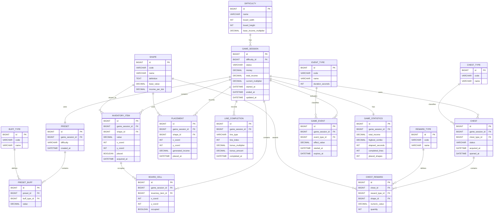

## 1. ER Diagram

```mermaid
erDiagram

    DIFFICULTY ||--o{ GAME_SESSION : has
    GAME_SESSION ||--|| PRESET : uses
    PRESET ||--o{ PRESET_BUFF : contains
    BUFF_TYPE ||--o{ PRESET_BUFF : defines

    GAME_SESSION ||--o{ INVENTORY_ITEM : contains
    SHAPE ||--o{ INVENTORY_ITEM : stored_as

    GAME_SESSION ||--o{ BOARD_CELL : contains
    INVENTORY_ITEM ||--o{ BOARD_CELL : occupies

    GAME_SESSION ||--o{ PLACEMENT : records
    SHAPE ||--o{ PLACEMENT : uses

    GAME_SESSION ||--o{ LINE_COMPLETION : records

    GAME_SESSION ||--o{ CHEST : owns
    CHEST_TYPE ||--o{ CHEST : classifies
    CHEST ||--o{ CHEST_REWARD : contains
    REWARD_TYPE ||--o{ CHEST_REWARD : defines
    SHAPE ||--o{ CHEST_REWARD : awards

    GAME_SESSION ||--o{ GAME_EVENT : activates
    EVENT_TYPE ||--o{ GAME_EVENT : classifies

    GAME_SESSION ||--|| GAME_STATISTICS : has

    DIFFICULTY {
        BIGINT id PK
        VARCHAR name
        INT board_width
        INT board_height
        DECIMAL base_income_multiplier
    }

    GAME_SESSION {
        BIGINT id PK
        BIGINT difficulty_id FK
        VARCHAR status
        DECIMAL money
        DECIMAL total_income
        DECIMAL current_multiplier
        DATETIME started_at
        DATETIME ended_at
        DATETIME updated_at
    }

    PRESET {
        BIGINT id PK
        BIGINT game_session_id FK
        VARCHAR difficulty
        DATETIME created_at
    }

    BUFF_TYPE {
        BIGINT id PK
        VARCHAR code
        VARCHAR name
    }

    PRESET_BUFF {
        BIGINT id PK
        BIGINT preset_id FK
        BIGINT buff_type_id FK
        DECIMAL value
    }

    SHAPE {
        BIGINT id PK
        VARCHAR code
        VARCHAR name
        TEXT definition
        DECIMAL base_value
        DECIMAL income_per_tick
    }

    INVENTORY_ITEM {
        BIGINT id PK
        BIGINT game_session_id FK
        BIGINT shape_id FK
        DECIMAL value
        INT x_coord
        INT y_coord
        BOOLEAN placed
        DATETIME acquired_at
    }

    BOARD_CELL {
        BIGINT id PK
        BIGINT game_session_id FK
        BIGINT inventory_item_id FK
        INT x_coord
        INT y_coord
        BOOLEAN occupied
    }

    PLACEMENT {
        BIGINT id PK
        BIGINT game_session_id FK
        BIGINT shape_id FK
        INT x_coord
        INT y_coord
        DECIMAL generated_income
        DATETIME placed_at
    }

    LINE_COMPLETION {
        BIGINT id PK
        BIGINT game_session_id FK
        VARCHAR line_type
        INT line_index
        DECIMAL bonus_multiplier
        DECIMAL bonus_amount
        DATETIME completed_at
    }

    CHEST_TYPE {
        BIGINT id PK
        VARCHAR code
        VARCHAR name
    }

    CHEST {
        BIGINT id PK
        BIGINT game_session_id FK
        BIGINT chest_type_id FK
        VARCHAR status
        DATETIME acquired_at
        DATETIME opened_at
    }

    REWARD_TYPE {
        BIGINT id PK
        VARCHAR code
        VARCHAR name
    }

    CHEST_REWARD {
        BIGINT id PK
        BIGINT chest_id FK
        BIGINT reward_type_id FK
        BIGINT shape_id FK
        DECIMAL numeric_value
        INT quantity
    }

    EVENT_TYPE {
        BIGINT id PK
        VARCHAR code
        VARCHAR name
        INT duration_seconds
    }

    GAME_EVENT {
        BIGINT id PK
        BIGINT game_session_id FK
        BIGINT event_type_id FK
        DECIMAL effect_value
        DATETIME started_at
        DATETIME expires_at
    }

    GAME_STATISTICS {
        BIGINT id PK
        BIGINT game_session_id FK
        DECIMAL total_income
        DECIMAL highest_combo
        INT elapsed_seconds
        INT completed_lines
        INT placed_shapes
    }
```