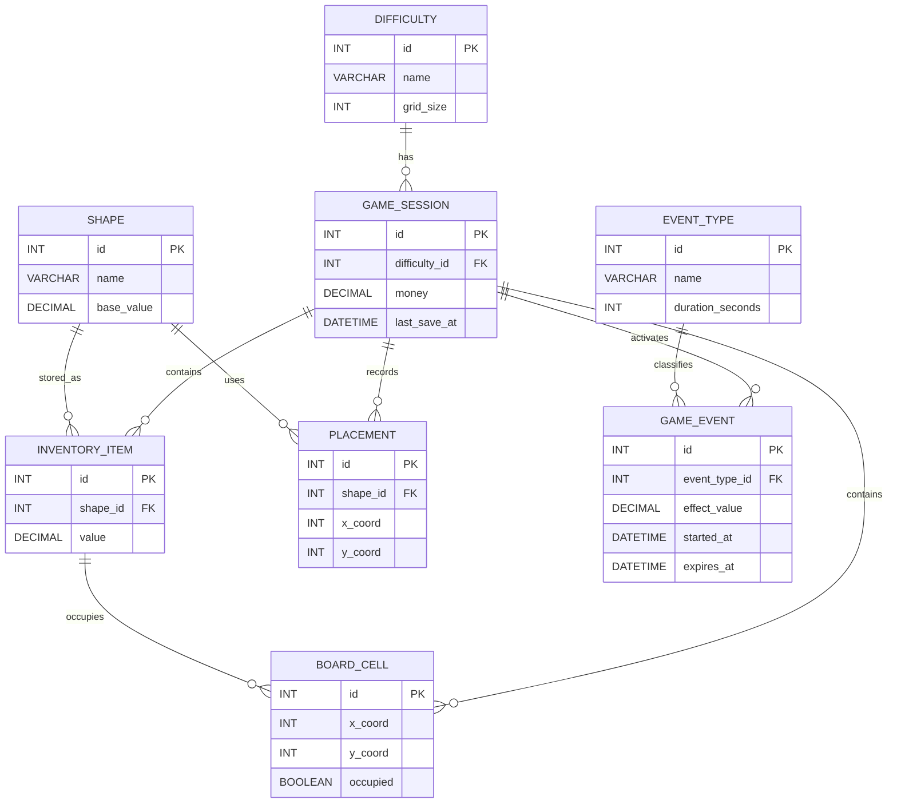

## 1. ER Diagram

```mermaid
erDiagram

    DIFFICULTY ||--o{ GAME_SESSION : has

    GAME_SESSION ||--o{ INVENTORY_ITEM : contains
    SHAPE ||--o{ INVENTORY_ITEM : stored_as

    GAME_SESSION ||--o{ BOARD_CELL : contains
    INVENTORY_ITEM ||--o{ BOARD_CELL : occupies

    GAME_SESSION ||--o{ PLACEMENT : records
    SHAPE ||--o{ PLACEMENT : uses

    GAME_SESSION ||--o{ GAME_EVENT : activates
    EVENT_TYPE ||--o{ GAME_EVENT : classifies


    DIFFICULTY {
        INT id PK
        VARCHAR name
        INT grid_size
    }

    GAME_SESSION {
        INT id PK
        INT difficulty_id FK
        DECIMAL money
        DATETIME last_save_at
    }

    SHAPE {
        INT id PK
        VARCHAR name
        DECIMAL base_value
    }

    INVENTORY_ITEM {
        INT id PK
        INT shape_id FK
        DECIMAL value
    }

    BOARD_CELL {
        INT id PK
        INT x_coord
        INT y_coord
        BOOLEAN occupied
    }

    PLACEMENT {
        INT id PK
        INT shape_id FK
        INT x_coord
        INT y_coord
    }

    EVENT_TYPE {
        INT id PK
        VARCHAR name
        INT duration_seconds
    }

    GAME_EVENT {
        INT id PK
        INT event_type_id FK
        DECIMAL effect_value
        DATETIME started_at
        DATETIME expires_at
    }

```